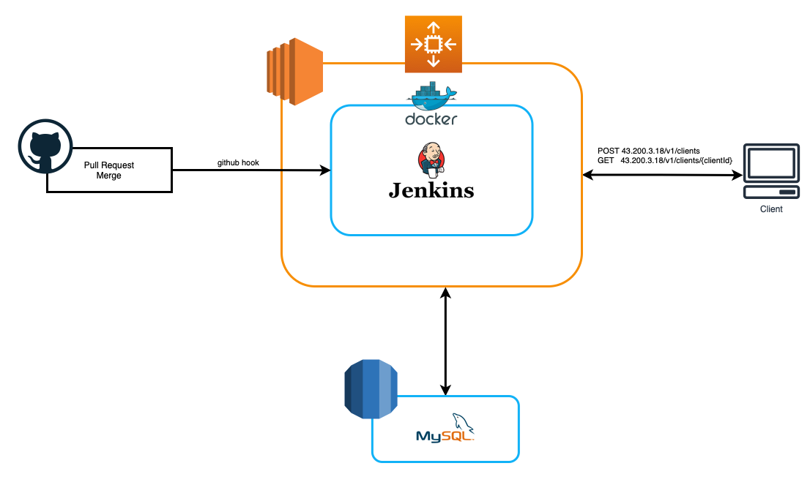
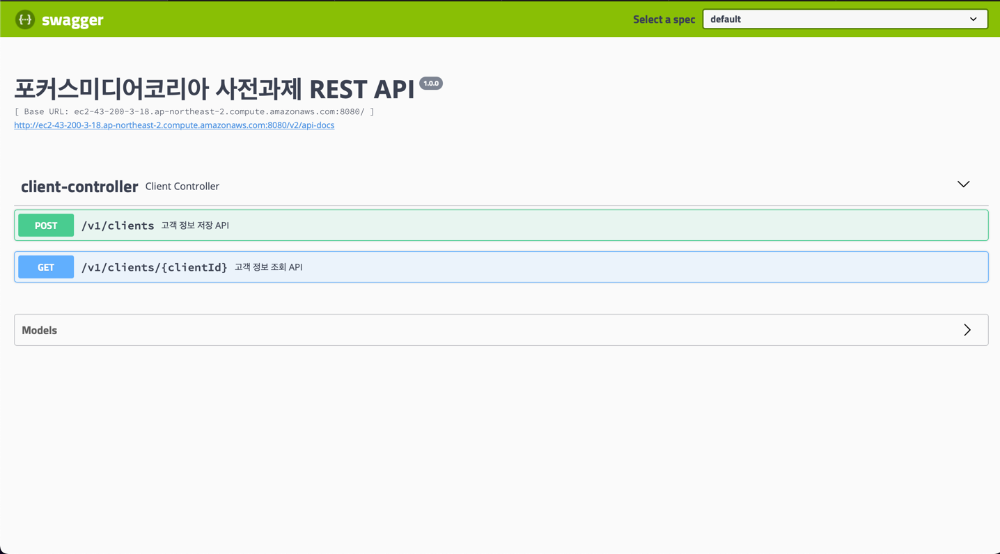

## Architecture

## Components

|          분류           |                         내용                          |
|:---------------------:|:---------------------------------------------------:|
| Language & Frameworks |                `Java`, `Spring Boot`                |
|       Database        |                       `MySQL`                       |
|         Infra         | `AWS EC2`, `AWS Auto Scaling`, `Docker`, `Jenkins`, |
|       API Docs        |                      `Swagger`                      |

## API Docs

- [API Docs 🔗](http://ec2-43-200-3-18.ap-northeast-2.compute.amazonaws.com:8080/swagger-ui.html#/)